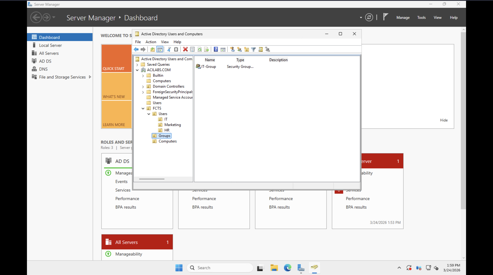
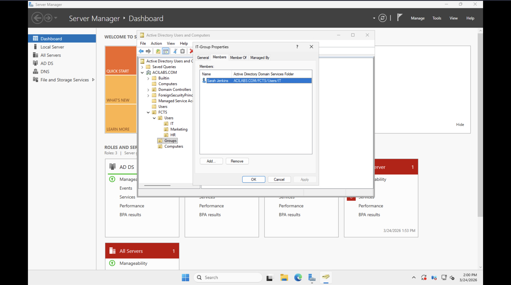
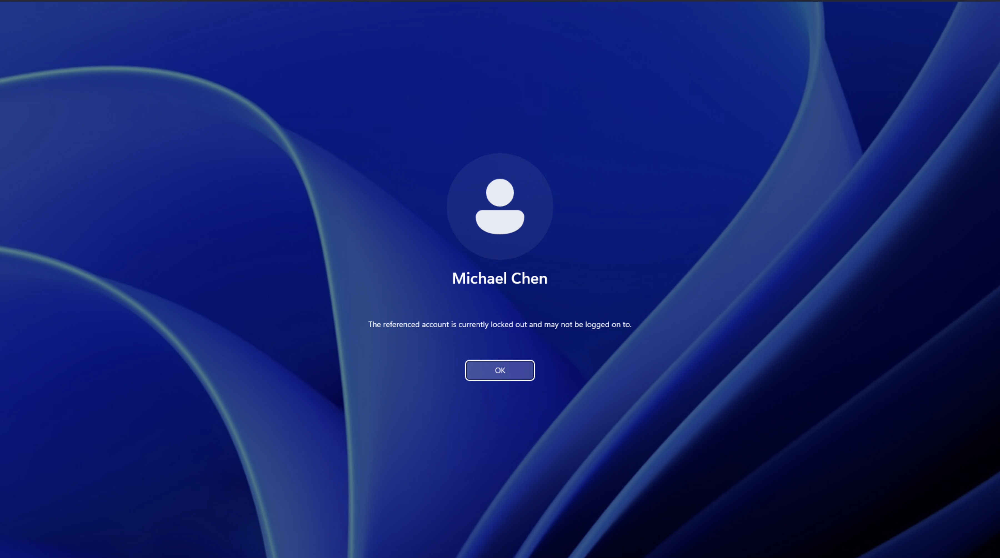

# 🛠️ Active Directory User Lifecycle & Ticketing Project

## 📋 Project Overview
This project demonstrates the core responsibilities of a Tier 1/2 IT Support Technician within an enterprise Active Directory environment. Using the **JobSkillShare (JSS)** sandbox, I designed and implemented a tiered **Organizational Unit (OU)** structure, managed user lifecycles (onboarding to termination), and resolved common security tickets including account lockouts and permission management.

---

### 💻 Environment & Tools
| Component | Specification |
| :--- | :--- |
| **Lab Environment** | JobSkillShare (JSS) IT Pro Sandbox |
| **Domain Controller** | Windows Server 2022 |
| **Client Workstation** | Windows 11 Pro (Domain Joined) |
| **Domain Name** | `ACILABS.COM` |
| **Organization Name** | Forest City Tech Solutions (FCTS) |

---

### 🎯 Core Skills Demonstrated
* **Directory Services:** OU Design, Object Nesting, and Attribute Management.
* **Account Security:** Password Resets, Account Unlocks, and Force-Password-Change policies.
* **Access Control:** Security Group management and membership verification.
* **Troubleshooting:** Resolving authentication issues and Access Token refresh latencies.

---

## 📂 Active Directory Design (OU Structure)
I avoided the default "Users" container to implement a professional, scalable hierarchy under the **FCTS** root OU:

```text
ACILABS.COM (Root)
└── FCTS (Top Level OU)
    ├── Groups (Security Groups)
    ├── Users (Employee Accounts)
    │   ├── IT
    │   ├── HR
    │   └── Marketing
    └── Computers (Workstations)
```


---

## 🎫 Help Desk Ticket Simulation


### 🟢 Ticket 1: New Hire Onboarding
> **User:** Sarah Jenkins | **Dept:** IT  
> **Task:** Provision access for a new IT technician.

* **Actions:** Created `sjenkins` in the **IT** OU and added her to the `IT-Group` security group in ADUC.
* **Verification:** Successfully authenticated on the Win11 Client and verified group SIDs via `whoami /groups`.
* **📸 Evidence:** 

---

### 🟠 Ticket 2: Account Lockout & Security Reset
> **User:** Michael Chen | **Dept:** HR  
> **Task:** Resolve lockout and force security rotation.

* **Actions:** Identified lockout status in ADUC. Performed password reset with "Unlock account" and "User must change password" flags enabled.
* **Verification:** Michael successfully logged in and was immediately prompted by Windows to set a new password.
* **📸 Evidence:** 

---

### 🔴 Ticket 3: Immediate Security Termination
> **User:** John Doe (Test) | **Dept:** Marketing  
> **Task:** Disable access immediately per HR request.

* **Actions:** Located object in **Marketing OU** and executed the **Disable Account** command.
* **Verification:** Confirmed the client login was blocked with the message: *"Your account has been disabled."*
* **📸 Evidence:** 

---

### 🔵 Ticket 4: Permission Management
> **Scenario:** Temporary project access.  
> **Task:** Grant and verify shared resource permissions.

* **Actions:** Added users to the `Marketing-Shared` Global Security Group in the **Groups** OU.
* **Troubleshooting:** Resolved token refresh latency by performing a sign-out/sign-in to update the Kerberos token on the workstation.
* **📸 Evidence:** 

---

### 🟡 Ticket 5: Department Transfer
> **User:** Michael Chen | **Dept:** Marketing  
> **Task:** Migrate object to new department OU.

* **Actions:** Migrated `mchen` from HR to the **Marketing** OU and updated the **Organization** tab attributes.
* **Verification:** Confirmed the Distinguished Name (DN) updated in the object properties and authentication remained stable.
* **📸 Evidence:** 
