#  Active Directory User Lifecycle & Ticketing Project

## Table of Contents
* [ Technical Stack](#️-technical-stack)
* [ Ticket 1: New Hire Provisioning](#-ticket-1-new-hire-provisioning--security-onboarding)
* [ Ticket 2: Identity Recovery](#-ticket-2-identity-recovery--security-reset)
* [ Ticket 3: Internal Transfer](#-ticket-3-internal-transfer--departmental-move)
* [ Ticket 4: Secure Offboarding](#-ticket-4-security-focused-user-offboarding)
* [ Key Learnings & Reflection](#-key-learnings--technical-reflection)

## Project Overview
This project simulates a real-world enterprise IT environment using the **JobSkillShare (JSS)** professional lab sandbox. I designed and implemented a tiered **Organizational Unit (OU)** structure from scratch to manage the full user lifecycle while resolving common Help Desk tickets.

---

###  Environment & Tools
| Component | Specification |
| :--- | :--- |
| **Lab Environment** | JobSkillShare (JSS) IT Pro Sandbox |
| **Domain Controller** | Windows Server 2022 |
| **Client Workstation** | Windows 11 Pro (Domain Joined) |
| **Domain Name** | `ACILABS.COM` |
| **Organization Name** | Forest City Tech Solutions (FCTS) |

---

## Active Directory Design (OU Structure)
I built a professional, scalable hierarchy under the FCTS root OU to ensure the directory stays organized as the company grows:

```text
ACILABS.COM (Root)
└── FCTS (Top Level OU)
    ├── Groups (Security Groups)
    ├── Users (Employee Accounts)
    │   ├── IT
    │   ├── HR
    │   └── Marketing
    └── Computers (Workstations)
```
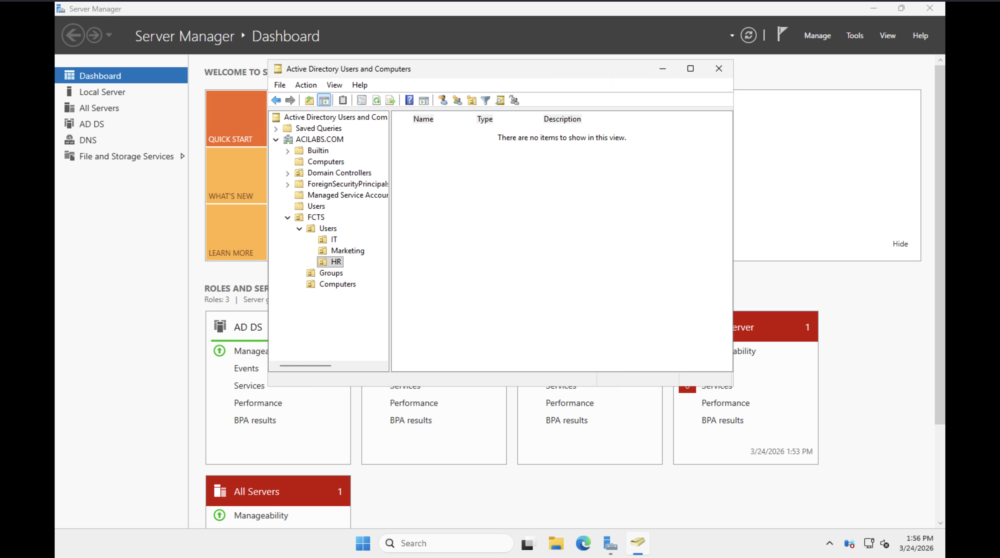

---

 ## Help Desk Ticket Simulation


### Ticket 1: New Hire Provisioning & Security Onboarding

> **Scenario:** A new hire, **Sarah Jenkins (sjenkins)**, joined the IT department. My goal was to set up her account following the company’s security and folder structure.

#### **Technical Actions:**
* **Implementation:** Created the user object `sjenkins` within the **FCTS > Users > IT** Organizational Unit. This ensures she automatically receives the correct department settings based on her physical location in the directory.
* **Access Control:** Established a **Global Security Group** named `IT-Group` within the **Groups** OU to facilitate Role-Based Access Control (RBAC).
* **Security Policy:** Enforced the `User must change password at next logon` requirement. This aligns with industry-standard security protocols, ensuring the Administrator has zero knowledge of the user’s permanent credentials.
* **Verification:** Successfully authenticated as `sjenkins` on the **Windows 11 Client**. Executed `whoami /groups` to verify that the IT-Group Security Identifier (SID) was correctly added to the user's Kerberos access token.

#### ** Technical Evidence:**

**1. ADUC Provisioning: Defining the `sjenkins` User Object**
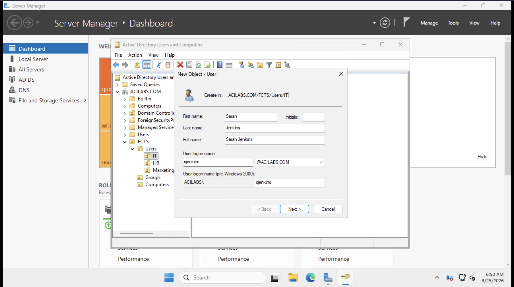
*Defining account name and logon credentials within the targeted IT Organizational Unit.*

**2. Credential Security: Enforcing Mandatory Password Change**
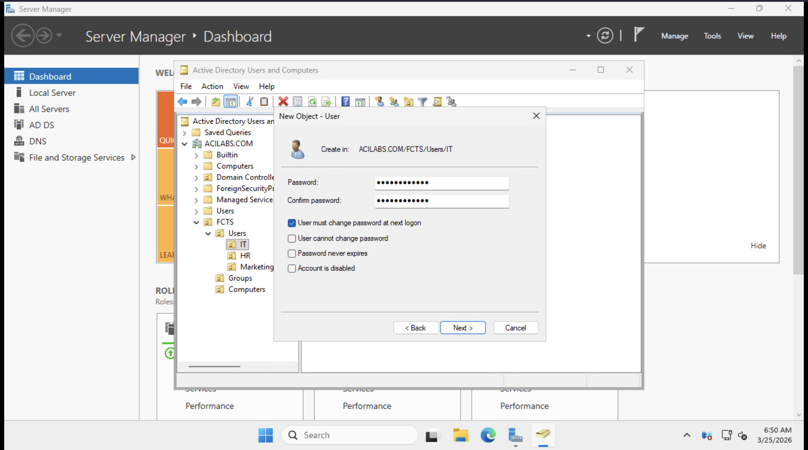
*Configuring initial security flags to ensure user-owned credential privacy.*

**3. RBAC Setup: Creating the `IT-Group` Security Group**
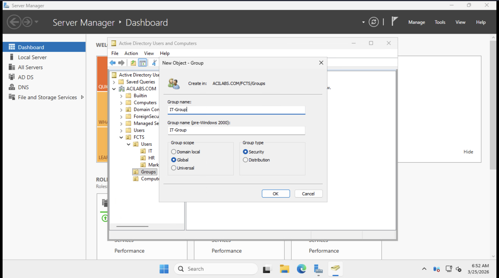
*Setting up the departmental security group for streamlined permission management.*

**4. Policy Verification: Forced Password Change on Client**
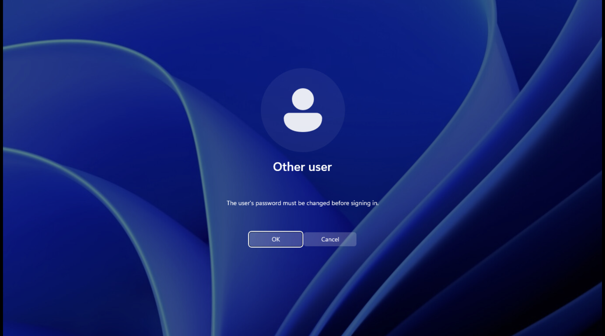
*Verifying that the server-side security policy propagated correctly to the Windows 11 workstation.*

**5. Technical Validation: Access Token Group Confirmation**
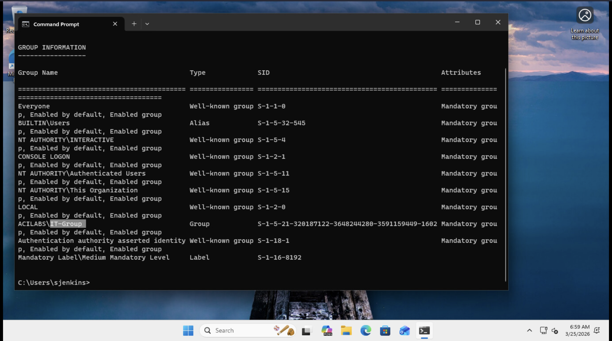
*Using CLI to confirm the account successfully inherited all IT-Group permissions.*

---

### Ticket 2: Identity Recovery & Security Reset

> **Scenario:** **Michael Chen (mchen)** from HR reported a total loss of workstation access. His account was locked out after multiple failed login attempts, triggering the domain's security protection.

#### **Technical Actions:**
* **Security Policy:** Configured an **Account Lockout Threshold** of 3 attempts via the **Default Domain Policy** to protect the environment against brute-force attacks.
* **Diagnostic:** Identified the lockout status on the Domain Controller by navigating to the **Account** tab in ADUC, confirming the user was restricted from authenticating.
* **Resolution:** Performed a secure administrative password reset while clearing the `Unlock the user's account` flag to restore immediate access.
* **Security Maintenance:** Re-enforced the `User must change password at next logon` policy to ensure the new temporary credential was immediately replaced by a private one known only to the user.

#### **Technical Evidence:**

**1. Security Enforcement: Account Lockout Message on Client**
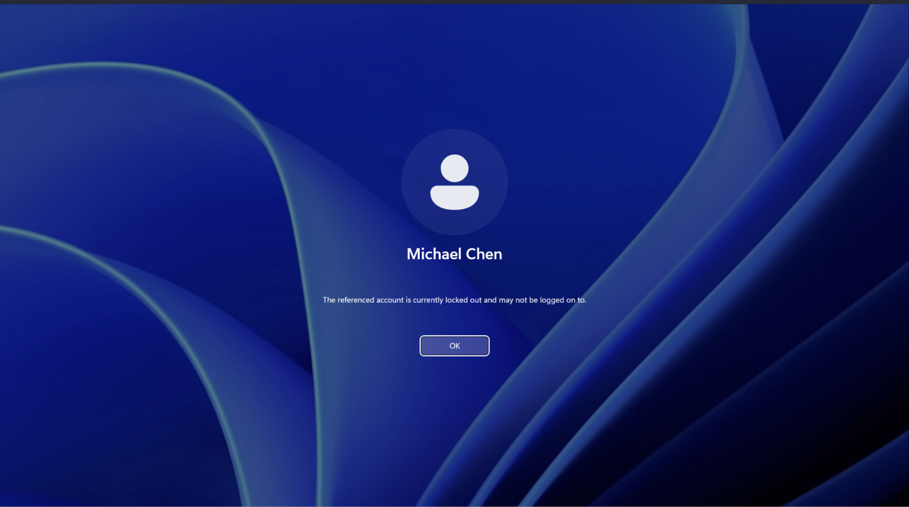
*Verifying the Active Directory security policy successfully blocked access on the Windows 11 workstation.*

**2. Admin Diagnostic: Identifying the Lockout in ADUC**
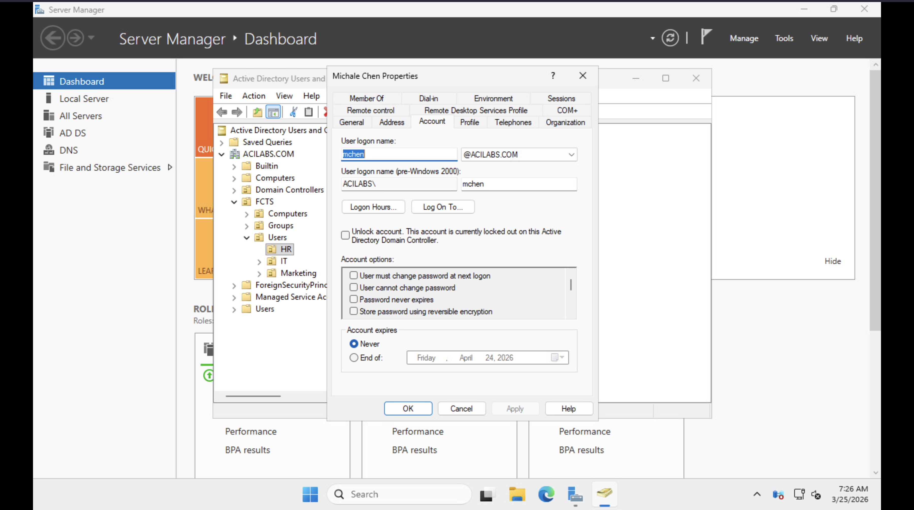
*Locating the specific lockout flag within the user's account properties on the Domain Controller.*

**3. Technical Resolution: Resetting Password and Unlocking Account**
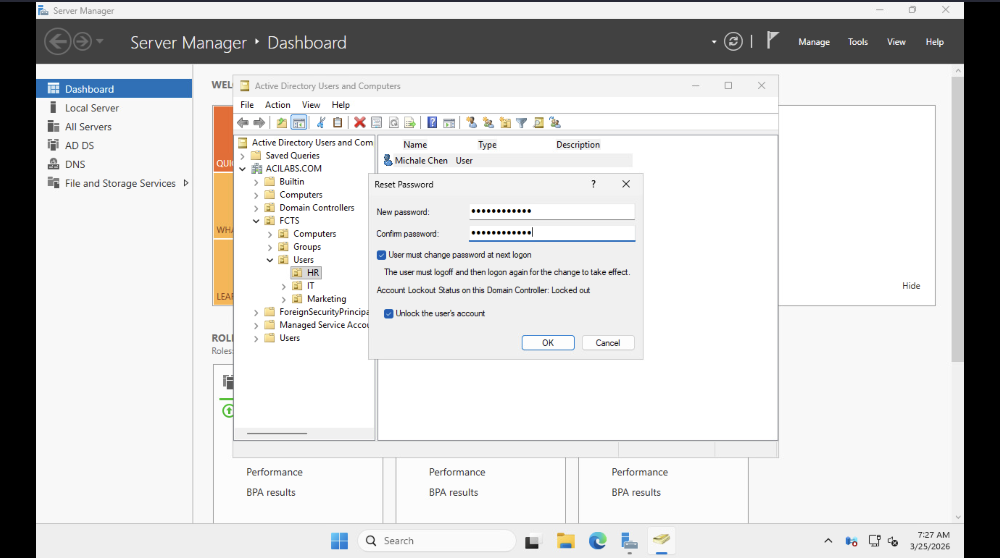
*Executing the recovery process to restore user access while maintaining administrative zero-knowledge security.*

---

### Ticket 3: Internal Transfer & Departmental Move

> **Scenario:** **Michael Chen** was promoted from HR to the IT Department. I was tasked with migrating his account to the new Organizational Unit and re-aligning his access permissions to match his new technical responsibilities.

#### **Technical Actions:**
* **OU Migration:** Physically migrated the `mchen` user object from the **HR OU** to the **IT OU**. This ensures the account inherits the correct Group Policy Objects (GPOs) and reflects the updated organizational hierarchy.
* **Permission Re-alignment:** Updated security group memberships by removing Michael from the legacy HR group and adding him to the **IT-Group**. This maintains the **Principle of Least Privilege** by revoking access to sensitive HR resources he no longer requires.
* **Communication Setup:** Created a new **Distribution Group** (`IT-Support-DL`) and enrolled Michael as a member. This facilitates departmental email communication without granting unnecessary administrative security rights.
* **Verification:** Validated that both IT team members are consolidated within the same security group and distribution list for streamlined management.

#### **Technical Evidence:**

**1. Directory Migration: User Object in the HR OU (Pre-Move)**
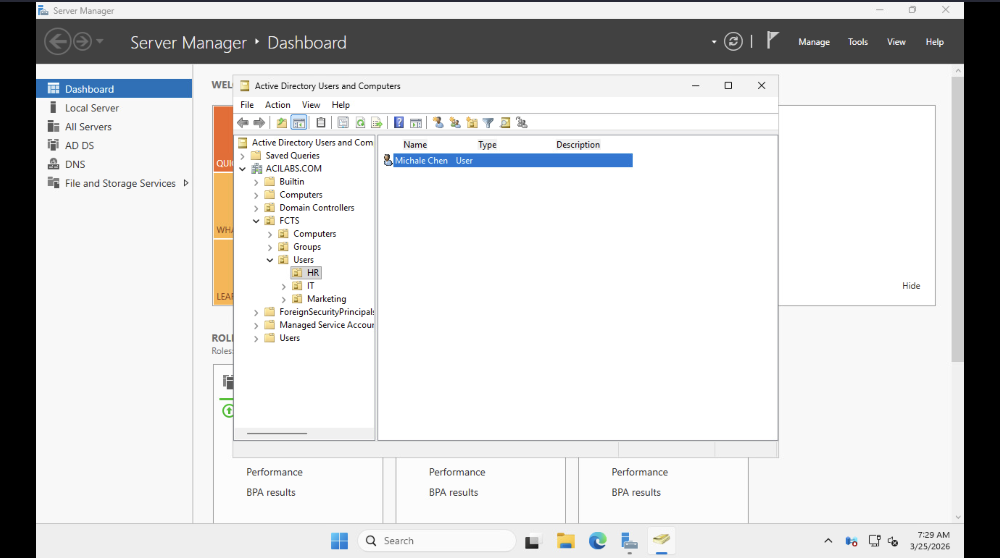
*Initial state showing the user object located within the HR Organizational Unit.*

**2. OU Migration: User Object Successfully Migrated to the IT OU**
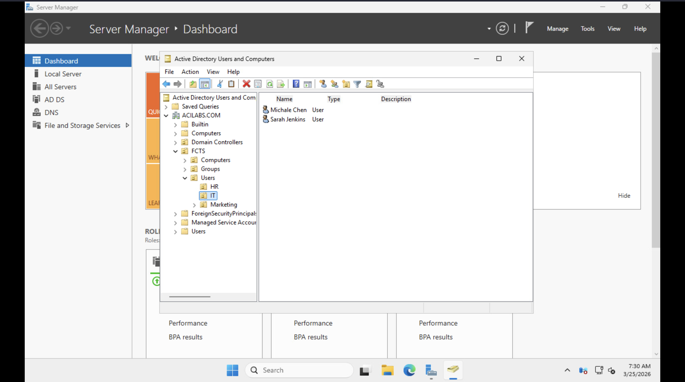
*Final state showing the user object relocated to the IT OU alongside the IT team.*

**3. RBAC Update: Granting Access to the `IT-Group`**
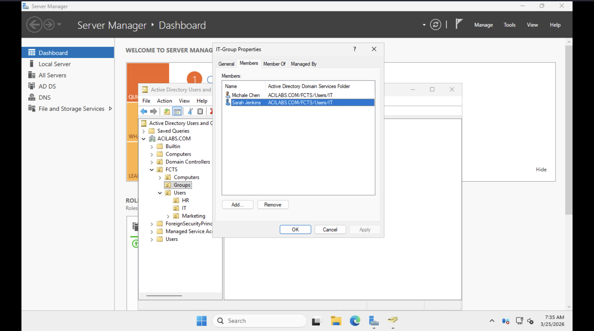
*Updating the security group members list to include the transferred user.*

**4. Communication Infrastructure: Enrolling Members in the `IT-Support-DL`**
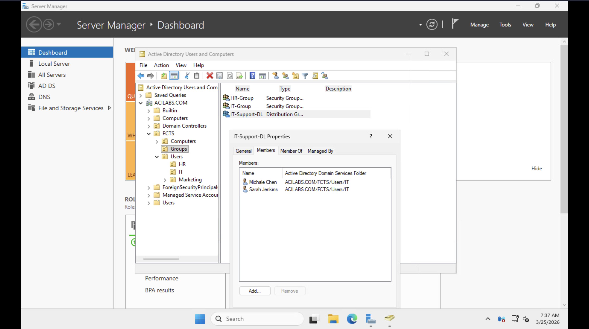
*Confirming the user is added to the departmental distribution list for internal communications.*

---

### Ticket 4: Security-Focused User Offboarding

> **Scenario:** **James Wilson (jwilson)** has left the Marketing department. My objective was to immediately revoke his access while maintaining organizational standards and directory hygiene.

#### **Technical Actions:**
* **Access Revocation:** Executed an immediate account disablement on the Domain Controller. Disabling an account is preferred over deletion in enterprise environments to preserve the user's Security Identifier (SID) for future data audits and ownership records.
* **Organizational Hygiene:** Migrated the disabled user object from the **Marketing OU** to a dedicated **Disabled Users OU**. This sequestering ensures that inactive accounts do not clutter production units or inherit active Group Policy Objects (GPOs).
* **Credential Neutralization:** Neutralized the account's existing credentials to prevent any potential service-level authentication or cached logins from remaining active.
* **Verification:** Performed a client-side login attempt on the **Windows 11 workstation** to confirm that the security policy is actively enforcing the "Account Disabled" state.

#### **Technical Evidence:**

**1. Secure Revocation: Confirming the Account Status Change**
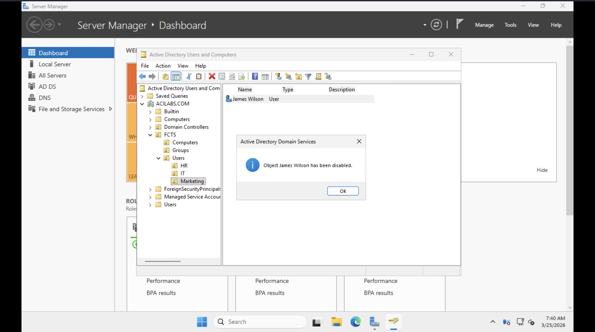
*Executing the 'Disable Account' command in ADUC to terminate all active domain authentication sessions.*

**2. Directory Maintenance: Sequestering Inactive Objects**
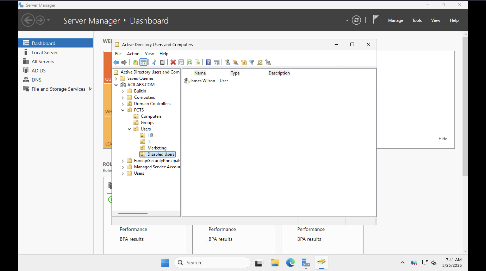
*Organizing the directory by moving the disabled account into a sequestered Organizational Unit.*

**3. Final Verification: Validating Policy Enforcement on Client**
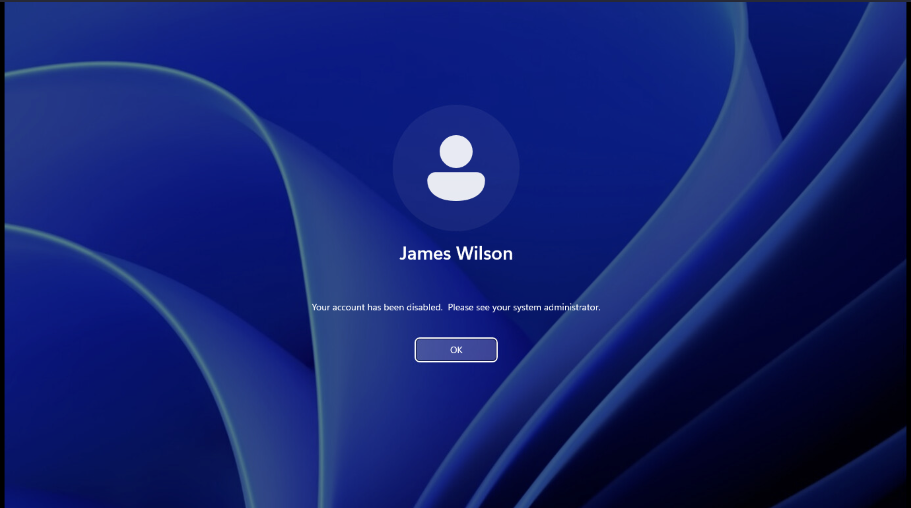
*Proof of success: The Windows 11 login screen confirms the account is disabled and access is denied.*

---

---

## Key Learnings & Technical Reflection

Completing this project provided hands-on experience with the critical responsibilities of a **System Administrator** and **IT Support Specialist**. Key takeaways include:

* **Security-First Mindset:** Understanding that identity management is the first line of defense. By enforcing "User must change password at next logon" and account lockout policies, I ensured the environment remains resilient against unauthorized access and brute-force attacks.
* **The Principle of Least Privilege:** Successfully managed lateral moves and transfers by auditing and revoking legacy permissions. This reduces the "attack surface" of the network.
* **Directory Hygiene:** Learned the importance of maintaining a clean Active Directory structure. Using dedicated OUs for Disabled Users ensures that automated scripts and GPOs don't accidentally target inactive accounts.
* **Lifecycle Management (JML):** Mastered the **Joiner-Mover-Leaver** process, which is the foundation of enterprise IT support.
